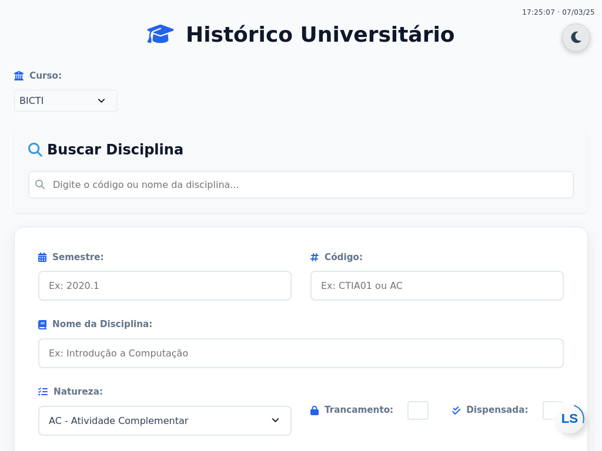

# Histórico Universitário UFBA



Uma aplicação web para gerenciar e acompanhar o histórico acadêmico dos estudantes da Universidade Federal da Bahia (UFBA), com suporte inicial para os cursos de BICTI e Engenharia de Produção.

🔗 [Acesse o projeto](https://historicoufba.vercel.app/)

## 📋 Sobre o Projeto

O Histórico Universitário UFBA é uma ferramenta que permite aos estudantes:

- Registrar e gerenciar disciplinas cursadas
- Acompanhar o progresso em direção à formatura
- Calcular médias e carga horária total
- Visualizar requisitos por natureza de componente
- Buscar disciplinas específicas do seu curso

### 🎓 Cursos Suportados

- BICTI (Bacharelado Interdisciplinar em Ciência, Tecnologia e Inovação)
  - Total de horas necessárias: 2400h
- Engenharia de Produção
  - Total de horas necessárias: 3750h

## 🚀 Funcionalidades

- **Seleção de Curso**: Escolha entre BICTI e Engenharia de Produção
- **Gerenciamento de Disciplinas**:
  - Adicionar disciplinas cursadas
  - Registrar notas e carga horária
  - Marcar disciplinas como trancadas
- **Filtro e Busca**:
  - Pesquisa por código ou nome da disciplina
  - Filtragem específica por curso
- **Resumo e Métricas**:
  - Média geral
  - Total de horas cursadas
  - Horas restantes por natureza
  - Progresso para formatura

## 🛠️ Tecnologias Utilizadas

- HTML5
- CSS3 (com organização modular)
- JavaScript (ES6+)
- LocalStorage para persistência de dados
- Font Awesome para ícones

## 📁 Estrutura do Projeto

```
.
├── assets/
│   ├── css/           # Estilos CSS organizados em módulos
│   ├── data/         # Dados JSON das disciplinas
│   └── img/          # Imagens e favicons
├── js/
│   ├── app.js        # Arquivo principal
│   └── modules/      # Módulos JavaScript
└── index.html        # Página principal
```

### 📊 Organização CSS

- **Base**: Reset, tipografia, variáveis e animações
- **Components**: Botões, formulários, ícones, tabelas
- **Features**: Filtros, períodos, resumos
- **Layout**: Container, footer, grid
- **Utils**: Responsividade, status

## 🚦 Como Usar

1. Acesse o [site do projeto](https://historicoufba.vercel.app/)
2. Selecione seu curso (BICTI ou Engenharia de Produção)
3. Adicione suas disciplinas cursadas:
   - Preencha o semestre
   - Insira código e nome da disciplina
   - Selecione a natureza
   - Informe carga horária e nota
4. Acompanhe seu progresso no painel de resumo

## 💻 Desenvolvimento Local

1. Clone o repositório:

```bash
git clone https://github.com/LuisT-ls/Historico-Universitario.git
```

2. Abra o projeto:

```bash
cd Historico-Universitario
```

3. Inicie um servidor local:

- Use o Live Server do VS Code

4. Acesse `http://localhost:5500` no navegador

## 🤝 Contribuindo

1. Faça um Fork do projeto
2. Crie uma branch para sua feature (`git checkout -b feature/AmazingFeature`)
3. Commit suas mudanças (`git commit -m 'Add some AmazingFeature'`)
4. Push para a branch (`git push origin feature/AmazingFeature`)
5. Abra um Pull Request

## 📝 Licença

Este projeto está sob a licença MIT. Veja o arquivo [LICENSE](LICENSE) para mais detalhes.

## 👨‍💻 Autor

Luís Teixeira - [GitHub](https://github.com/LuisT-ls)

## 🎯 Status do Projeto

🚧 Em desenvolvimento contínuo...

---

⌨️ com ❤️ por [Luís Teixeira](https://github.com/LuisT-ls)
