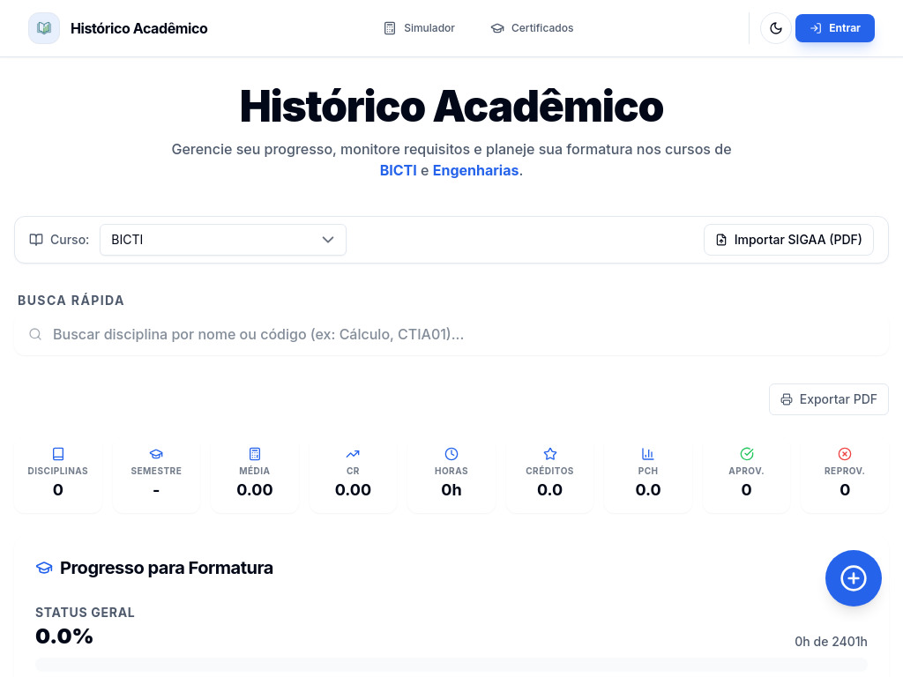

# 📚 Histórico Acadêmico UFBA v2.4

> [!IMPORTANT]
> **Aviso Legal:** Este é um projeto **independente** desenvolvido para auxiliar os estudantes do **ICTI/UFBA (Campus de Camaçari)**. Este software **não possui vínculo oficial** com a Universidade Federal da Bahia (UFBA) ou com a administração do SIGAA.

Uma plataforma moderna e intuitiva para estudantes da UFBA gerenciarem sua trajetória acadêmica. O sistema permite o upload do histórico do SIGAA, calcula estatísticas em tempo real e oferece uma visão clara do progresso rumo à formatura.



## 🚀 Acesse Agora
[https://historicoacademico.vercel.app](https://historicoacademico.vercel.app)

---

## ✨ Funcionalidades Principais

### 📊 Gestão Acadêmica Inteligente
- **Importação de PDF:** Basta subir seu histórico do SIGAA e o sistema extrai todas as disciplinas automaticamente, ignorando duplicatas e registros já existentes.
- **Cálculo de CR:** Coeficiente de Rendimento calculado em tempo real, seguindo as normas da UFBA.
- **Semestralização Oficial:** Cálculo de período letivo baseado na fórmula oficial do SIGAA, com suporte a suspensões e perfil inicial.
- **Semestre Atual Dinâmico:** O semestre corrente é calculado automaticamente com base na data do sistema, sem necessidade de configuração manual.
- **Visualização de Progresso:** Gráficos e barras de progresso por natureza de disciplina (OB, OG, OX, OH, OZ, OP, AC, LV).

### 💡 Disciplinas Pendentes e Recomendações
- **Recomendações Contextuais:** O sistema analisa seu histórico e recomenda disciplinas com base nas suas necessidades reais:
  - **Sequência lógica:** Se você concluiu Cálculo A, recomenda Cálculo B automaticamente (suporte a numerais romanos I→V e letras A→D).
  - **Déficit de horas:** Prioriza disciplinas das categorias onde ainda faltam horas para a formatura.
  - **Detecção de formatura:** Se as disciplinas em curso já cobrem todos os déficits restantes, o painel de recomendações é ocultado automaticamente.
- **Badges de déficit:** Exibe quanto falta em cada categoria (ex: `OG: 144h`) diretamente no cabeçalho do painel.

### 📈 Evolução do CR
- **Gráfico de linha duplo:** Visualize o CR acumulado (linha sólida) e a média isolada de cada semestre (linha tracejada) no mesmo gráfico.
- **Tendência de desempenho:** Identifique visualmente semestres de melhora ou queda no rendimento.
- **Linhas de referência:** Marcações em 5,0 e 7,0 para contextualizar o desempenho.
- **Tooltip detalhado:** Ao passar o mouse, exibe CR acumulado e média do semestre lado a lado.

### 🔐 Segurança e Sincronização
- **Autenticação Firebase:** Login via Google ou Email/Senha com re-autenticação exigida para operações sensíveis.
- **Sincronização Cloud:** Dados salvos no Firestore com regras de segurança server-side por operação (`create`, `update`, `delete`).
- **Validação de URLs:** Links externos de certificados são validados antes de serem abertos (`https://` / `http://` apenas).
- **Privacidade:** Opção de manter seu perfil privado ou público, com controle granular.

### 🌐 Perfil Público
- **Link compartilhável:** Cada usuário possui um perfil público acessível em `/u/[userId]`.
- **Controle de privacidade:** Apenas perfis configurados como públicos são visíveis externamente.
- **Visão completa para terceiros:** O perfil público exibe CR, horas por categoria, disciplinas aprovadas e certificados de atividades complementares.

### 🖨️ Exportar PDF / Modo de Impressão
- **Exportar PDF:** Botão "Exportar PDF" no resumo acadêmico aciona o diálogo nativo de impressão do navegador.
- **Layout otimizado:** O modo de impressão (`@media print`) exibe um documento estruturado com cabeçalho, tabela de métricas, progresso por categoria e histórico completo de disciplinas.
- **Sem dependências extras:** Utiliza a API nativa do navegador (`window.print()`), sem bibliotecas adicionais.

### 🗓️ Grade de Horários
- **Visualização automática:** Disciplinas marcadas como "em curso" aparecem automaticamente na grade semanal.
- **Código de horário:** Insira códigos no formato UFBA (ex: `46T56` = Quarta+Sexta, Tarde, slots 5–6) para posicionar cada disciplina na grade.
- **Grade visual:** Exibe os horários de Segunda a Sexta (e Sábado quando necessário), de 07:00 às 22:10, com rowspan automático para aulas de múltiplos horários.
- **Persistência:** Códigos de horário salvos no Firebase — disponíveis após logout e novo login.

### 🎓 Grade Curricular
- **Visualização completa:** Todas as disciplinas obrigatórias do curso organizadas por semestre, com status de conclusão em tempo real.
- **Múltiplas naturezas:** Abas dedicadas para Obrigatórias (OB), Optativas (OP/OX/OG), Atividades Complementares (AC/OZ) e Livres (LV).
- **Matching inteligente:** Correspondência em três camadas — código exato → prefixo de turma (ex: `CTIA10B`) → nome canônico — para garantir que disciplinas cursadas em períodos diferentes sejam corretamente reconhecidas.
- **Nota e período corretos:** Exibe sempre a nota e o semestre da tentativa aprovada, ignorando reprovações e trancamentos anteriores.
- **Seleção de curso:** Suporte a múltiplos cursos do catálogo (ex: BICTI, Eng. de Computação), com alternância direta na página.
- **Sem dados:** Funciona mesmo sem importação — exibe todas as disciplinas como pendentes até que o histórico seja importado.

### 📈 Ferramentas Avançadas
- **Simulador de Notas:** Planeje quanto precisa tirar para atingir sua meta de CR.
- **Gestão de Certificados:** Adicione horas complementares e veja o impacto no seu progresso.
- **Previsão de Formatura:** Estimativa dinâmica de quando você deve concluir o curso com base no ritmo atual.

---

## 🛠️ Stack Tecnológica

O projeto foi totalmente migrado para as tecnologias mais modernas do ecossistema Web:

- **Framework:** [Next.js 16.1.6 (App Router)](https://nextjs.org/)
- **Linguagem:** [TypeScript](https://www.typescriptlang.org/)
- **Estilização:** [Tailwind CSS](https://tailwindcss.com/)
- **Componentes:** [Shadcn/UI](https://ui.shadcn.com/) & [Framer Motion](https://www.framer.com/motion/)
- **Banco de Dados & Auth:** [Firebase](https://firebase.google.com/) (Firestore, Auth, Storage)
- **Gráficos:** [Recharts](https://recharts.org/)
- **Relatórios:** [jsPDF](https://github.com/parallax/jsPDF) & [SheetJS (XLSX)](https://sheetjs.com/)
- **Impressão:** API nativa do navegador (`window.print()` + `@media print`)

---

## 🔄 Changelog

### v2.4 — Grade Curricular

- **Nova página `/grade`:** Grade Curricular completa e interativa.
- **Disciplinas por semestre:** Obrigatórias organizadas por semestre do curso, com status visual (aprovado, em curso, pendente).
- **Matching em três camadas:** Código exato → prefixo de turma (sufixo de turma como `CTIA10B`) → nome canônico do catálogo — resolve casos onde o código do SIGAA difere do catálogo.
- **Nota e período da aprovação:** Sempre exibe a nota e o semestre da tentativa aprovada, nunca de reprovações ou trancamentos.
- **Abas por natureza:** OB, OP/OX/OG, AC/OZ, LV — cada grupo com sua própria visualização.
- **Seleção de curso:** Alternância de curso diretamente na página, sem necessidade de recarregar.
- **SEO protegido:** Página autenticada com `robots: noindex, nofollow`.

---

### v2.3 — Grade de Horários

- **Nova página `/horarios`:** Grade semanal interativa das disciplinas em curso, com visualização de Segunda a Sábado e slots de 07:00 às 22:10.
- **Código de horário:** Suporte ao formato padrão UFBA (ex: `46T56` — dias, turno e slots). Células com múltiplos horários usam rowspan automático.
- **Persistência no Firebase:** Códigos de horário salvos em `users/{userId}.horarioCodes` — disponíveis após logout e re-login.
- **Disciplinas automáticas:** Disciplinas marcadas como "em curso" aparecem automaticamente na grade, sem configuração manual.

---

### v2.2 — Qualidade, Segurança e Arquitetura

#### 🔒 Segurança
- **Firestore Rules corrigidas:** Regras separadas por operação (`allow create`, `allow update`, `allow delete`) corrigem bug que bloqueava silenciosamente todas as exclusões em produção. Adicionada imutabilidade do campo `userId` nos updates.
- **Validação de URLs externas:** Função `isSafeExternalUrl()` bloqueia protocolos perigosos (`javascript:`, `data:`, `vbscript:`) antes de qualquer `window.open()`. Links externos abertos com `noopener,noreferrer`.
- **CSP endurecido:** Removido `https://unpkg.com` do `script-src`. Domínios de imagem restritos a `*.googleusercontent.com` e `*.firebaseusercontent.com`. Removido header `X-XSS-Protection` depreciado.

#### 🏗️ Arquitetura
- **Camada de serviço completa:** Todo acesso ao Firebase consolidado em `services/` — eliminados imports diretos do Firebase nos componentes de interface.
- **Schema do Firestore corrigido:** `updateProfile` agora usa dot-notation (`profile.course`, `profile.enrollment`, etc.) para atualizar campos aninhados sem sobrescrever o objeto `profile` inteiro.
- **Import estático do catálogo:** `disciplinas.json` migrado de fetch runtime (com cache-busting) para static import em tempo de build — elimina requisição de rede e garante disponibilidade offline.
- **localStorage como cache-only:** Escrita no localStorage gateada com `!user` — usuários logados usam exclusivamente o Firestore como fonte de verdade.
- **Componentes `Select` padronizados:** Todos os `<select>` nativos substituídos pelo componente `Select` do design system (shadcn/ui), garantindo consistência visual e suporte a dark mode.
- **Dirty-check por campo:** Substituído `JSON.stringify` na comparação de perfil por `isProfileDirty()` — evita serialização desnecessária e falsos positivos.

#### 🧪 Testes
- **88 novos testes:** Cobertura adicionada para `services/firestore.service.ts`, `services/auth.service.ts` e `lib/certificate-ocr.ts` — incluindo mocks de Firestore, guards de autenticação e todos os padrões de extração OCR.
- **Thresholds por arquivo:** Coverage mínimo configurado individualmente para os módulos críticos de `lib/` e `services/`.

---

### v2.1 — Funcionalidades e Experiência

- **Semestre dinâmico:** Substituído o valor fixo `'2025.2'` por `getCurrentSemester()` em todo o sistema.
- **Disciplinas Pendentes inteligentes:** Recomendações com progressão sequencial (numerais romanos e letras) e priorização por déficit de categoria.
- **Ocultação automática de pendentes:** Painel suprimido quando disciplinas em curso já cobrem todos os déficits restantes.
- **Gráfico de CR expandido:** CR acumulado (linha sólida) e média isolada por semestre (linha tracejada) no mesmo gráfico, com tooltip detalhado.
- **Exportar PDF:** Modo de impressão otimizado via `window.print()`, sem dependências externas.
- **Importação de PDF aprimorada:** Duplicatas internas ao PDF e registros já existentes são ignorados, com resumo ao final.
- **Perfil público:** Página `/u/[userId]` com controle de privacidade e visão completa para visitantes autorizados.

---

## 📐 Lógica de Semestralização (UFBA)

O sistema implementa rigorosamente a fórmula de período letivo do SIGAA:

`Semestralização = (Total de Semestres Cursados) – (Número de Suspensões) + (Perfil Inicial)`

- **Total de Semestres:** Tempo transcorrido desde o ingresso.
- **Suspensões:** Períodos de trancamento total ou mobilidade.
- **Perfil Inicial:** Créditos externos (dispensas/transferências) que aceleram a semestralização.
  - *Nota: Disciplinas cursadas normalmente na UFBA não alteram o perfil inicial, apenas o tempo decorrido.*

---

## 📁 Estrutura do Projeto

```text
Historico-Universitario/
├── 📁 app/               # Rotas e Páginas (Next.js App Router)
├── 📁 components/        # Componentes UI e lógicas de interface
│   ├── 📁 features/      # Funcionalidades específicas (Dashboard, Summary)
│   ├── 📁 layout/        # Cabeçalho, Rodapé, Sidebar
│   └── 📁 ui/            # Componentes base (Shadcn)
├── 📁 lib/               # Utilitários, Config Firebase, Lógicas de cálculo
├── 📁 public/            # Assets estáticos e imagens
├── 📁 types/             # Definições de tipos TypeScript
├── 📁 __tests__/         # Testes Unitários e Integração (Jest)
└── 📁 e2e/               # Testes de Ponta a Ponta (Playwright)
```

---

## 💻 Desenvolvimento Local

### Pré-requisitos
- Node.js 22.x ou superior
- NPM ou Yarn

### Instalação

1. Clone o repositório:
```bash
git clone https://github.com/LuisT-ls/Historico-Universitario.git
cd Historico-Universitario
```

2. Instale as dependências:
```bash
npm install
```

3. Configure as variáveis de ambiente (.env.local):
```env
NEXT_PUBLIC_FIREBASE_API_KEY=...
NEXT_PUBLIC_FIREBASE_AUTH_DOMAIN=...
NEXT_PUBLIC_FIREBASE_PROJECT_ID=...
# ... (restante das credenciais do Firebase)
```

4. Inicie o servidor de desenvolvimento:
```bash
npm run dev
```

---

## 🧪 Testes

Cobertura robusta com Jest + React Testing Library e Playwright para E2E.
Veja [TESTES.md](./TESTES.md) para comandos, estrutura e detalhes de cobertura por suite.

---

## 🤝 Contribuição

Contribuições são bem-vindas! Veja [CONTRIBUTING.md](./CONTRIBUTING.md) para configuração do ambiente, convenções de commit, como estender o parser do SIGAA, adicionar novos cursos e abrir um PR.

---

## 📄 Licença

Este projeto está sob a licença **MIT**. Veja o arquivo [LICENSE](LICENSE) para detalhes.

---

## 👨‍💻 Desenvolvedor
**Luís Antonio Souza Teixeira**  
[](https://github.com/LuisT-ls)
[](https://linkedin.com/in/luis-tei)
[](https://instagram.com/luis.tei)

---
⭐ **Gostou do projeto? Deixe uma estrela no GitHub!**
